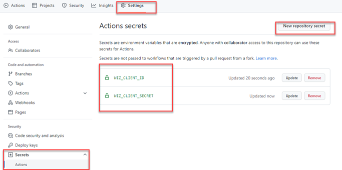
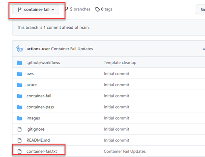
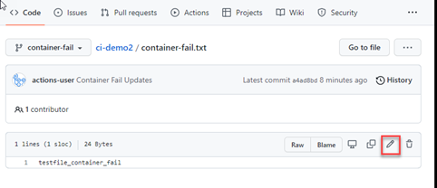
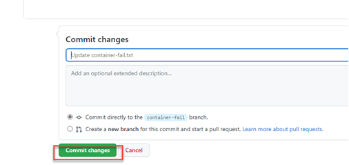
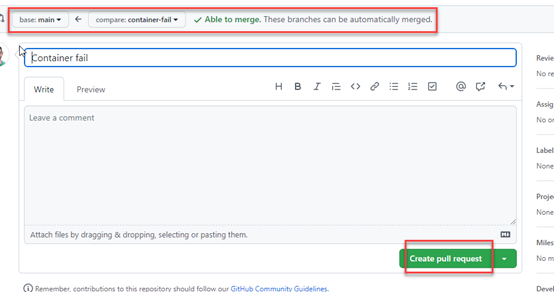

# Wiz SE Demo Repository - Github

### Description
This repository is dedicated to providing a starting point for SE demos using CI integration for WizCLI

## Requirements

* Github Account
* Wiz Service Account (`security_scan:create`)
* Ability to work with branches in Git

### OPTIONAL - Supporting requirements for dev machine

* Git installed
* VS Code
* Wiz-CLI
* AWSCLI installed and operational
* Azure CLI installed and operational
* Terraform >= 1.0 installed and operational
* Docker installed and running

## Basic Setup

1. Create a new repository from the template repository


2. Set repository target and name (customize name to fit your needs)

NOTE: BE SURE TO SELECT YOUR PERSONAL REPO


4. Get coffee

☕️ Template cleanup process takes a few minutes

5. Check for branches


6. Recreate repository secrets (obtained from Wiz service account `security_scan:create`)
  * WIZ_CLIENT_ID
  * WIZ_CLIENT_SECRET


## Basic Usage

This repo is configured to have the following branches

* container-pass
* container-fail
* iac-pass
* iac-fail
* main

1. Each branch has a text file in the root of the branch with the same name referred to here as `branch-file.txt`.

2. To make code PRs easier you can simply modify the text in the `branch-file.txt` to get a code change to submit.



3. Double click the file to access the editor.



4. Add or change contents of the file and commit changes



5. Navigate back to the repo root and you should see `compare & pull request`


6. Simply use all of the defaults and select `create pull request`



7. Repeat for the other branches branches

The guthub actions located in `.github/workflows` will provide the required actions during PRs

The `iac` branch will use the `wiz-scan-iac.yaml` action and the `container` branch will use the `wiz-scan-container.yaml` action.

### OPTIONAL - VS Code Setup

Clone down a local copy of the repo and add it to VS Code
Verify that you have all of the required branches

```
> git fetch
> git branch
  container-pass
  iac-pass
  container-fail
  iac-fail
* main
```
Use the git checkout command to swicth between branches
```
> git checkout iac
Switched to branch 'iac-pass'
Your branch is up to date with 'origin/iac-pass'.
```
### Container Scanning

<b>Inventory</b></br>
| Item | Purpose|
--------|--------|
|secret.yaml| Contains secret in yaml|
|Dockerfile| Image build instructions|
|awssecret.txt|Contains secret in text|

### IaC Scanning

<b>Inventory</b></br>
| Folder | Purpose|
--------|--------|
|`aws/terraforn-eks`| Terraform instructions to build an EKS cluster |
|`azure/terraform-aks`| Terraform instruction to build an AKS cluster|

### Rebasing branches

Due to drift in the branches you may find that you need to rebase your banches back to main.

The below example will `rebase` your branch with the `main` branch bringing it in direct sync with the `main` branch.

NOTE: This will `stash` any changes you have in this branch!!

```
> git checkout <branch>
> git stash
> git rebase origin/main
> git push --force
```

